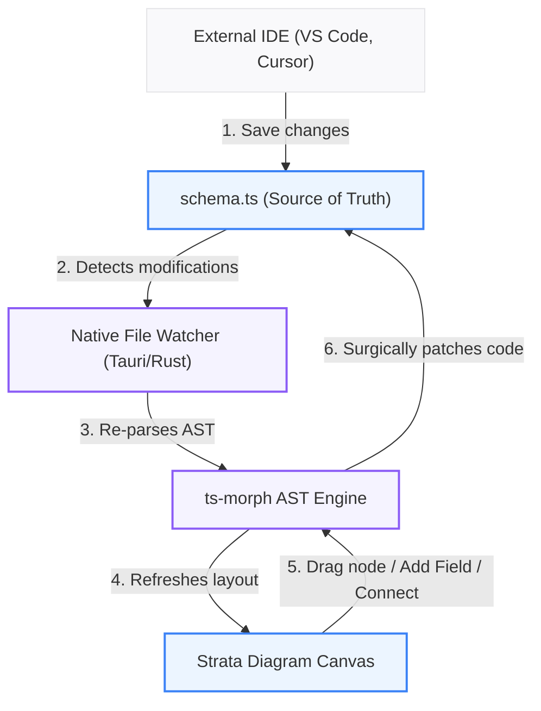

# Strata: Visual Schema Design & AI Integration Guide

Strata is a high-performance, local-first Entity Relationship Diagram (ERD) tool for **Drizzle ORM v0.45.2 & Cloudflare D1 (SQLite)**. 
Unlike typical tools that rely on sidecar configurations or database snapshots, Strata maintains **zero internal database state**. Your `schema.ts` is the single source of truth.

---

## 🔄 The Bi-Directional Architecture

Strata operates on a real-time, bi-directional synchronization loop between your physical code on disk and the interactive visual canvas:



*   **Code ➔ UI:** When you make edits in an external editor or in the Code editor tab, the Tauri filesystem watcher instantly re-parses the abstract syntax tree (AST) and updates the visual diagram.
*   **UI ➔ Code:** When you drag tables, add columns, or draw connections on the canvas, Strata surgically updates only the relevant sections of your `schema.ts` code without disturbing standard documentation or surrounding code.

---

## 🏗️ The `@strata` Metadata Standard

Strata stores all visual coordinate information and Cloudflare storage bindings directly inside **standard JSDoc comments** preceding each table declaration.

### Metadata Schema Properties

| Property | Type | Required | Description |
| :--- | :--- | :--- | :--- |
| **`target`** | `"d1"` \| `"do"` \| `"kv"` | Yes | Determines the visual appearance, styling accent, and code generation mode. |
| **`x`** | `number` | Yes | The absolute horizontal visual grid position. |
| **`y`** | `number` | Yes | The absolute vertical visual grid position. |

### Visual Accent Mapping

*   **D1 (`"d1"`):** standard SQL database tables. Styled with a **Cobalt Blue** header (`badge-primary`).
*   **Durable Objects (`"do"`):** SQLite storage blocks residing within Cloudflare DO actors. Styled with a **Sky Blue** header (`badge-secondary`).
*   **KV Namespaces (`"kv"`):** key-value metadata binding representations. Styled with an **Indigo Violet** header (`badge-accent`).

---

## 🔗 Relationships: Physical vs. Logical

Strata visualizes connections based on how they are declared in your TypeScript definitions:

1.  **Physical Foreign Keys (Solid Lines):**
    *   Declared inline using the `.references()` column modifier.
    *   **Syntax Example:** `authorId: integer("author_id").references(() => users.id)`
2.  **Logical Drizzle Relations (Dashed, Animated Lines):**
    *   Declared using Drizzle's `relations()` query-builder.
    *   Allows seamless nested queries in your application code.
    *   **Syntax Example:** `export const postsRelations = relations(posts, ({ one }) => ({ ... }))`

---

## 📝 Complete Schema Blueprint Example

Below is a production-grade blueprint illustrating D1 relational tables, logical relations blocks, SQLite-specific date mappings (stored as unix integers), and fully compliant `@strata` JSDoc blocks:

```typescript
import { sqliteTable, integer, text } from "drizzle-orm/sqlite-core";
import { relations } from "drizzle-orm";

/**
 * @strata { "target": "d1", "x": 100, "y": 150 }
 */
export const users = sqliteTable("users", {
  id: integer("id").primaryKey({ autoIncrement: true }),
  email: text("email").notNull().unique(),
  createdAt: integer("created_at", { mode: "timestamp" }).notNull(),
});

/**
 * @strata { "target": "d1", "x": 500, "y": 150 }
 */
export const posts = sqliteTable("posts", {
  id: integer("id").primaryKey({ autoIncrement: true }),
  title: text("title").notNull(),
  content: text("content").notNull(),
  authorId: integer("author_id")
    .notNull()
    .references(() => users.id, { onDelete: "cascade" }),
});

// Logical relations mapping (Visualised as elegant dashed lines in Strata)
export const usersRelations = relations(users, ({ many }) => ({
  posts: many(posts),
}));

export const postsRelations = relations(posts, ({ one }) => ({
  author: one(users, {
    fields: [posts.authorId],
    references: [users.id],
  }),
}));
```

---

## 🤖 AI / LLM Integration Prompt

Copy and paste the system prompt below into your AI chat context (Claude 3.5 Sonnet, Gemini 1.5 Pro, ChatGPT-4o) when designing your Cloudflare and Drizzle architectures:

```markdown
You are an expert software architect specialized in Drizzle ORM and Cloudflare D1 (SQLite dialect).
We are using Strata, an interactive ERD tool that parses our \`schema.ts\` file in real-time.

You MUST follow these design & layout rules when writing or modifying Drizzle schema code for me:

1. AESTHETICS & METADATA: Every table or collection declaration MUST be preceded by a standard JSDoc comment containing Strata visual coordinates. Do NOT strip or omit these:
   /**
    * @strata { "target": "d1" | "do" | "kv", "x": number, "y": number }
    */

2. GRID LAYOUT: Pre-calculate visual layout positions (x, y coordinates) for new tables. Space them out logically (e.g. 400px apart horizontally, 300px apart vertically) to avoid overlaps.

3. DATATYPES (Cloudflare D1 / SQLite):
   - SQLite does not have a native Date type. Always map dates using:
     integer("column_name", { mode: "timestamp" }) or integer("column_name", { mode: "timestamp_ms" })
   - Ensure all column constraints match Drizzle core SQLite capabilities.

4. RELATIONSHIPS:
   - Physical foreign keys: Use inline \`.references()\` declarations (renders as solid lines on diagram).
     Example: authorId: integer("author_id").references(() => users.id, { onDelete: "cascade" })
   - Logical relations: Use Drizzle's \`relations()\` query-builder api (renders as dashed lines on diagram). Ensure they follow the naming standard \`\${tableName}Relations\`.
     Example: export const postsRelations = relations(posts, ({ one }) => ({ author: one(users, { fields: [posts.authorId], references: [users.id] }) }))
```
